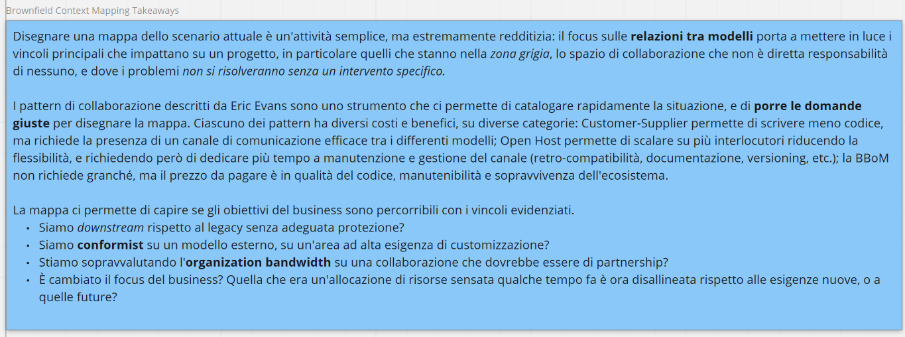

# Context mapping

Uno strumento per farsi delle domande

- È uno strumento di esplorazione della politica dello sviluppo
- Permette di fare domande su collaborazione
- Permette di capire se avrò il problema di deliverare "perché' gli altri non deliverano"